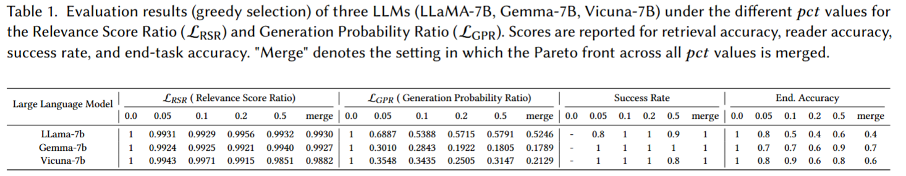

# Adversarial Robustness of RAG with text only.
This project evaluates the adversarial robustness of RAG systems, which use LLMs for open-domain question answering task, by using NSGA-II as a multi-object optimization algorithm.




# Usage
Navigate to the project directory

- **Install required packages**:
   Run the following command to make the setup script executable:

   ```bash
   chmod +x vast_ai.sh
   ./vast_ai.sh
   ```
- **Login to Hugging Face**: Use the following command to authenticate and access the LLMs and DPR models:
    ```bash
    huggingface-cli login: <access_token>
    ```

- **Run the attack**: Execute the following command to run the adversarial attack:
    ```bash
    python main.py --reader_name llama-7b -n_iter 100 -pct_words_to_swap 0.2 --algorithm NSGAII
    ```
# Repo structure
- **`algorithm.py`**: Implements the NSGA-II algorithm for multi-objective optimization.
- **`evaluate.py`**: Evaluates the adversarial robustness of RAG systems.
- **`fitness.py`**: Defines fitness functions for optimization.
- **`population.py`**: Manages the population for the genetic algorithm.
- **`reader.py`**: LLMs proccess.
- **`retrieval.py`**: Implements retrieval methods for RAG systems.
- **`typo_transformation.py`**: Applies typo transformations to generate adversarial examples.
- **`utils.py`**: Contains utility functions, including visualization tools.
- **`visualize.ipynb`**: Jupyter Notebook for visualizing results.

# Inspired From
This project is inspired by multiple works and repositories:

- [AttackText](https://textattack.readthedocs.io/en/master/): Provides tools and techniques for generating adversarial examples in NLP tasks.
- [pymoo](https://pymoo.org/): A Python library for multi-objective optimization, which inspired the implementation of NSGA-II in this project.
- *Typos that Broke the RAG's Back: Genetic Attack on RAG Pipeline by Simulating Documents in the Wild via Low-level Perturbations*: This paper inspired the typo transformation techniques implemented in `typo_transformation.py` and their idea.

Each of these sources has contributed to shaping the methodology, implementation, and experimental setup of this project.